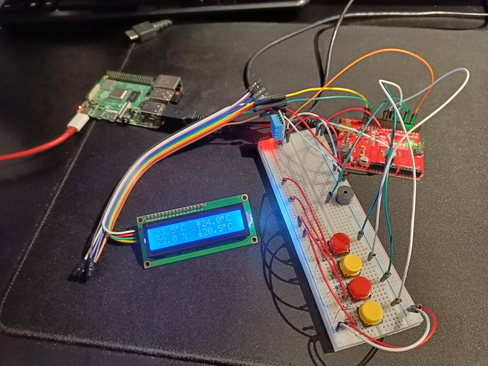
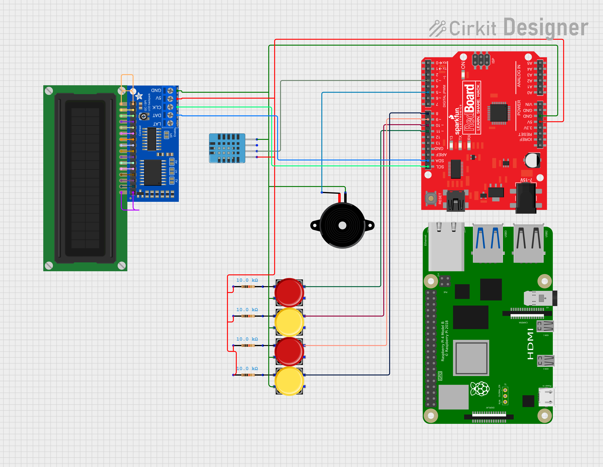
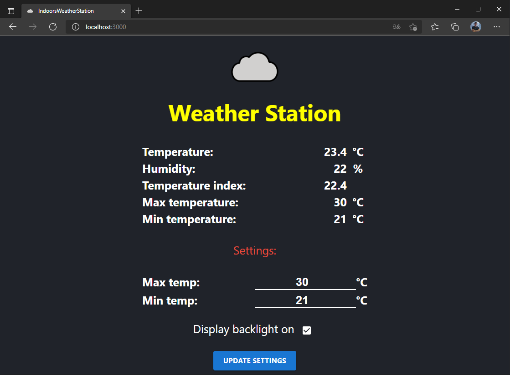
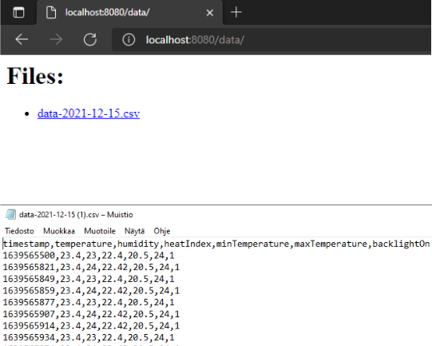

# IndoorsWeatherStation
Arduino and Raspberry Pi powered indoor weather monitoring tool.

The project consists of:
- ***Arduino*** monitoring weather data using the attached DHT11 sensor, buttons, active speaker and 1602 I2C LCD-screen.
- ***Client*** with live data from the station through a socket connection. Can also change the settings and control the lcd of the weather station in real time.
- ***Server*** that reads serial data from the station and forwards it to the client. It also forwards the settings received from the client to the station. It also generates csv data which can be downloaded or fetched.

